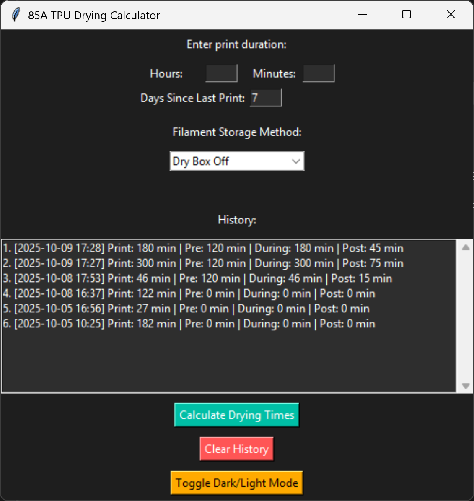

# 85A-TPU-Dry-Box-Time-Calculator

A simple desktop app that helps 3D printing enthusiasts calculate pre-print, during-print, and post-print drying times for 85A TPU filament.  
Features a modern dark/light GUI, quick calculations, and the app saves every run to a local `history.json` and shows a scrollable in-app history so you can review past print durations and previous recommended pre/during/post drying times.



- 🕐 Calculates drying times based on print duration  
- 🌡️ Uses a fixed drying temperature of **50°C**  
- 🕶️ Modern dark-theme interface  
- 💡 Includes helpful TPU drying recommendations  
- 💻 Works on Python (.py / .pyw) or as a packaged executable (.exe)  
- ⚠️ Older versions used different drying heuristics and may produce inaccurate results. Please use the latest release for best results.

---

## 🚀 How to Use

1. **Launch the app**
   - Run `85A_TPU_Dry_Box_Time_Calculator_V1.0.pyw` or `85A_TPU_Dry_Box_Time_Calculator_V1.0.py` (Python version)  
   - Run `85A_TPU_Dry_Box_Time_Calculator_V1.0.exe` (executable version)

2. **Enter print duration**
   - Input your print’s estimated time (hours and minutes)  
   - Input how many days since your last print  
   - Select how your filament was stored since the last print (Dry Box On / Dry Box Off / Sealed Bag / Open Air)

3. **View recommended drying times**
   - The app calculates pre-print, during-print, and post-print drying times instantly and records the run in `history.json`.

---

## 💻 Requirements

- Python 3.10+ (tested on Windows 11)  
- `tkinter` (usually included with Python on Windows/macOS; on Debian/Ubuntu run `sudo apt install python3-tk`)  
- Optional: `pyinstaller` (if you want to build a single-file `.exe`)

If you're on Debian/Ubuntu, make sure `tkinter` is installed:

```bash
# Debian/Ubuntu
sudo apt update
sudo apt install python3-tk
```

---

## 💾 Building From Source

If you’d like to modify or run the app yourself:

```bash
git clone https://github.com/skiingbeast2025/85A-TPU-Dry-Box-Time-Calculator.git
cd 85A-TPU-Dry-Box-Time-Calculator
python 85A_TPU_Dry_Box_Time_Calculator_V1.0.pyw
```

> Note: `.pyw` on Windows runs without a console window. Use `.py` when building with PyInstaller if you prefer.

---

## 📦 Packaging (Windows / macOS / Linux)

You can run the app from source (Python) or build a single-file executable for distribution. Below are practical instructions for each OS.

> **General tips**
> - Build on the **target OS** whenever possible (Windows builds on Windows, macOS builds on macOS). Cross-building is possible but more fragile.  
> - Use a virtual environment for clean builds:

```bash
python -m venv venv

# macOS / Linux:
source venv/bin/activate

# Windows (cmd.exe):
venv\Scripts\activate

# Windows (PowerShell):
.\venv\Scripts\Activate.ps1

pip install pyinstaller
```

(Copy/paste note: in the Windows code blocks above the single backslashes \ are correct for PowerShell/CMD.)

---

### 🪟 Windows (PyInstaller — Recommended)

1. Install PyInstaller:

```bash
pip install pyinstaller
```

2. Build a one-file `.exe` (no console window):

```bash
pyinstaller --onefile --noconsole --icon=3d-printer-icon.ico \
  --add-data "assets;assets" \
  85A_TPU_Dry_Box_Time_Calculator_V1.0.pyw
```

- `--noconsole` prevents a console window from appearing.  
- `--add-data "assets;assets"` bundles the `assets/` folder (Windows uses `;` as the separator).  
- The generated file will be `dist/85A_TPU_Dry_Box_Time_Calculator_V1.0.exe`.

3. Test the `.exe` by running it (double-click or from PowerShell). `history.json` and `setup.json` will be created next to the executable when the program runs.

---

### 🍏 macOS (py2app or PyInstaller)

**Option A — py2app**

```bash
pip install py2app
```

Minimal `setup.py`:

```python
from setuptools import setup

APP = ['85A_TPU_Dry_Box_Time_Calculator_V1.0.pyw']

setup(
    app=APP,
    options={'py2app': OPTIONS},
    setup_requires=['py2app'],
)
```

Build:

```bash
python setup.py py2app
```

The `.app` bundle will appear in `dist/`.

**Option B — PyInstaller (macOS build)**

```bash
pyinstaller --onefile --windowed --icon=3d-printer-icon.icns \
  --add-data "assets:assets" \
  85A_TPU_Dry_Box_Time_Calculator_V1.0.pyw
```

> Use `:` as the `--add-data` separator on macOS/Linux.  
> Note: distributing on macOS may require code signing / notarization.

---

### 🐧 Linux (PyInstaller / AppImage)

Install PyInstaller:

```bash
pip install pyinstaller
```

Build:

```bash
pyinstaller --onefile --windowed --icon=3d-printer-icon.png \
  --add-data "assets:assets" \
  85A_TPU_Dry_Box_Time_Calculator_V1.0.pyw
```

- The `--add-data` separator on Linux/macOS is `:`.  
- The result will be `dist/85A_TPU_Dry_Box_Time_Calculator_V1.0` (use `chmod +x` if required).  
- Optional: create an AppImage for broader Linux distribution.

---

### 🔗 Important `--add-data` Notes

- Windows → `--add-data "src;dest"`  
- macOS/Linux → `--add-data "src:dest"`  

Use the correct separator for the target platform or bundled assets may be missing.

---

### 🗂 Runtime Files (history.json / setup.json)

When users run the packaged app, `history.json` and `setup.json` are created in the same folder as the executable so data persists across runs. When running from source, those files are created in the working directory.

If you don’t want these files in your repo, add them to `.gitignore`:

```gitignore
# Local app state
history.json
setup.json

# Python
__pycache__/
*.pyc

# Build
dist/
build/
*.spec
```

---

### 📤 Distribute via GitHub Releases

1. Build the executable on your target OS.  
2. Go to **Releases → Draft a new release** in GitHub.  
3. Attach the built file(s) (`.exe`, `.app`, or Linux binary / `.zip`).  
4. Publish the release so users can download without building.

---

### ⚠️ Troubleshooting & Tips

- If the GUI fails to start on Linux, install `tkinter`:

```bash
sudo apt update
sudo apt install python3-tk
```

- If assets (icons/screenshots) are missing, re-check the `--add-data` syntax and test the app from the `dist/` folder.  
- Use `.pyw` locally on Windows to avoid a console window. For packaged builds, use `--noconsole` in PyInstaller.  
- For macOS distribution outside the App Store, code sign and notarize the `.app` to avoid Gatekeeper issues.  
- Always build on the OS you intend to distribute to for the best results.

---

## ⚡ Running the Pre-Built Executable

If you prefer the single-file `.exe` version (Windows):

1. Download the `.exe` from the latest release.  
2. Double-click to run — no Python installation needed.

You can also package it locally:

```bash
pyinstaller --onefile --noconsole 85A_TPU_Dry_Box_Time_Calculator_V1.0.pyw
```

---

## 🧠 TPU Notes

- Recommended drying temperature: **50°C**  
- Suggested initial drying time after opening a new spool: **6–7 hours**  
- Keep filament sealed in a dryer box or airtight bag with silica gel between prints.  
- Recommended to only use 85A TPU while using drying times calculated by this app.

---

## 📝 License

This project is licensed under the **Apache License 2.0**.  
See the [LICENSE](LICENSE) file for details. 
