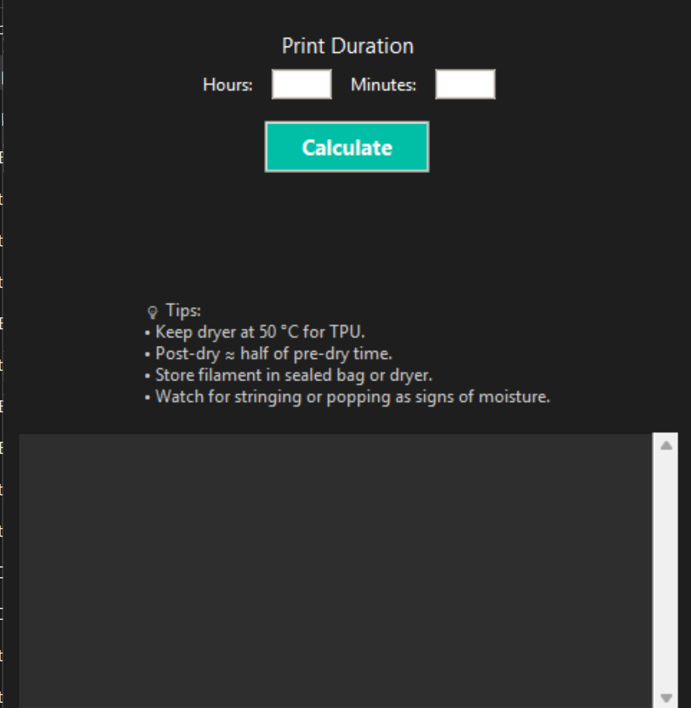

# 85A-TPU-Dry-Box-Time-Calculator

A simple desktop app that helps 3D printing enthusiasts figure out how long to dry their 85A TPU filament before, during, and after printing.  
Features a dark GUI, quick calculations, and built-in drying tips.



- 🕐 Calculates drying times based on print duration  
- 🌡️ Uses a fixed drying temperature of **50°C**  
- 🕶️ Modern dark-theme interface  
- 💡 Includes helpful TPU drying recommendations  
- 💻 Works on Windows (.exe) and Python (.py)

## 🚀 How to Use

1. **Launch the app**
   - Run `tpu_dry_calculator.py` (Python version), or  
   - Double-click the `tpu_dry_calculator.exe` (Windows build)

2. **Enter print duration**
   - Input your print’s estimated time (in hours or minutes)

3. **View recommended drying times**
   - The app instantly calculates how long to dry your filament before, during, and after printing.

---

## 💾 Building from Source

If you’d like to modify or build the app yourself:

```bash
git clone https://github.com/<your-username>/85A-TPU-Dry-Box-Time-Calculator.git
cd 85A-TPU-Dry-Box-Time-Calculator
python tpu_dry_calculator.py
```

You can package it into an .exe with:

```bash
pyinstaller --onefile --noconsole tpu_dry_calculator.py
```

---

## 🧠 Notes

- Recommended drying temperature: **50°C**  
- Suggested initial drying time after opening a new spool: **6–7 hours**  
- Keep filament sealed in a dryer box or airtight bag with silica gel between prints.
- Recommended to only use 85A TPU while using dry times calculated by this app.

---

## 📝 License

This project is licensed under the **Apache License 2.0**.  
See the [LICENSE](LICENSE) file for details.
