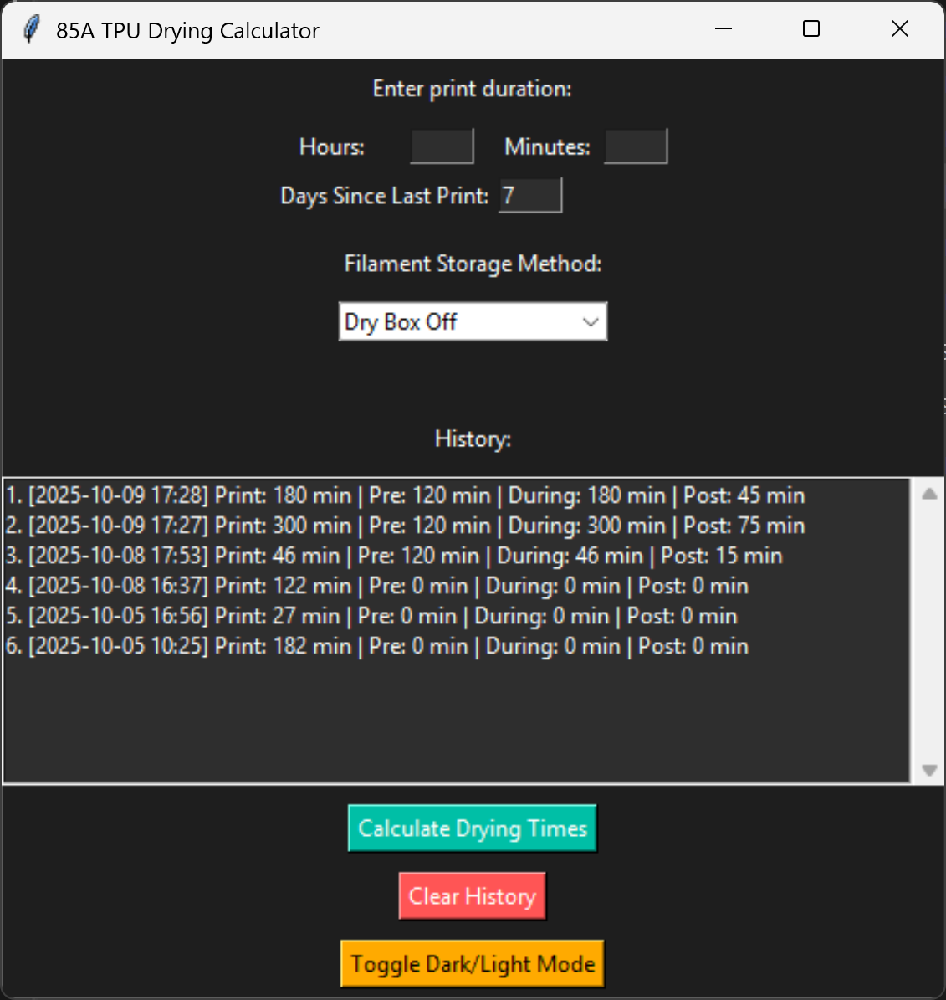

# 85A-TPU-Dry-Box-Time-Calculator

A simple desktop app that helps 3D printing enthusiasts calculate pre-print, during-print, and post-print drying times for 85A TPU filament.  
Features a modern dark/light GUI, quick calculations, and the app saves every run to a local `history.json` and shows a scrollable in-app history so you can review past print durations and previous recommended pre/during/post drying times.



- 🕐 Calculates drying times based on print duration  
- 🌡️ Uses a fixed drying temperature of **50°C**  
- 🕶️ Modern dark-theme interface  
- 💡 Includes helpful TPU drying recommendations  
- 💻 Works on Python (.py)
- ⚠️ Older versions used different drying heuristics and may produce inaccurate results. Please use the latest release for best results.

## 🚀 How to Use

1. **Launch the app**
   - Run `Dry_Box_Time_Calculator_V1.1.pyw` (Python version)
   - Run `Dry_Box_Time_Calculator_V1.1.exe` (executable version)

2. **Enter print duration**
   - Input your print’s estimated time (in hours or minutes)
   - Input when your last print was
   - Input how you stored your fillimant since last print

3. **View recommended drying times**
   - The app instantly calculates how long to dry your filament before, during, and after printing.

---

## 💾 Building from Source

If you’d like to modify or build the app yourself:

```bash
git clone https://github.com/Skiingbeast2025/85A-TPU-Dry-Box-Time-Calculator.git
cd 85A-TPU-Dry-Box-Time-Calculator
python tpu_dry_calculator.py
```

You can package it into an .exe with:

```bash
pyinstaller --onefile --noconsole tpu_dry_calculator.py
```

---

## 🧠 TPU Notes

- Recommended drying temperature: **50°C**  
- Suggested initial drying time after opening a new spool: **6–7 hours**  
- Keep filament sealed in a dryer box or airtight bag with silica gel between prints.
- Recommended to only use 85A TPU while using dry times calculated by this app.

---

## 📝 License

This project is licensed under the **Apache License 2.0**.  
See the [LICENSE](LICENSE) file for details.
